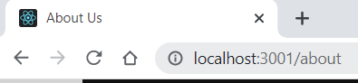
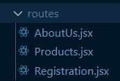

# React Project Report

<br>

## API
In our group we decided to build a webshop where we sold coding classes.
We did not use an existing API and instead created our own database.

```
var courseData = [
  {
    id: 1,
    name: "JavaScript",
    price: 1000,
    instructor: "Jahirul Haq",
    image: "https://i.ibb.co/0jHqtM0/javascript.png",
  },
```
<br>

## Hooks

We used hooks in a couple of different places in our code. We used both 'useState' and 'useEffect'. We used a useEffect in order to change the title of the document so the you can se what page you are on in the browser.

```
useEffect(() => {
    document.title = "About Us";
  }, []);
```



We used a useState hook in our Shop.jsx component that allows you to add a course to the cart and update the order summary.

```
  const [cart, setCart] = useState([]);

  const handleCourse = (course) => {
    const newCart = [...cart, course];
    setCart(newCart);
  };
```
<br>
<br>

## Props

We use props in for example our Course.jsx component. The prop allows us to add the images, course title, instructor and price that are stored in our databas to the cards displaying our courses.

```
const Course = (props) => {
  const { name, price, instructor, image } = props.course;
  return (
    <Container fluid>
      <Stack direction="horizontal" gap={5}>
        <Card className="card-style">
          <Card.Img variant="top" src={image} className="course-img" />
          <Card.Body>
            <Card.Title>
              Couse Title: <span className="course-name">{name}</span>
            </Card.Title>
```
<br>

## SPA

Our page qualify as a SPA since our webpage uses only one html page. With the use of routing and different components we have built the index.html page located in the public folder gets rewrittet every time you go to a new page instead of having seperate html pages for each page you visit.



```
  <BrowserRouter>
    <Routes>
      <Route path="/" element={<App />} />
      <Route path="about" element={<AboutUs />} />
      <Route path="products" element={<Products />} />
      <Route path="registration" element={<Registration />} />
    </Routes>
  </BrowserRouter>
```
<br>
<br>

## Responsive/Component library
In order for our webpage to be responsive we used a couple different methods. For some components, for example the navbar and the cards displaying our courses, we used react bootstrap. On other components we used flex box and media queries, for example on the footer and the about us page.

```
import { Button, Card, Container, Stack } from "react-bootstrap";
```
```
.about-container {
  display: flex;
}

.about-text-container {
  display: flex;
  flex-direction: column;
  justify-content: center;
  width: 100%;
  text-align: center;
  padding-left: 80px;
  padding-right: 80px;
}
```
```
 @media screen and (max-width: 820px) {
  .footer-links {
    padding-top: 2rem;
  }

  .footer-link-wrapper {
    flex-direction: column;
  }
} 
```

<br>

### By: Jeanette Ljungkvist


