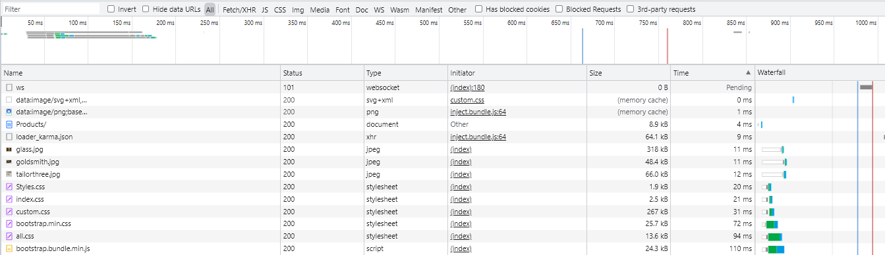
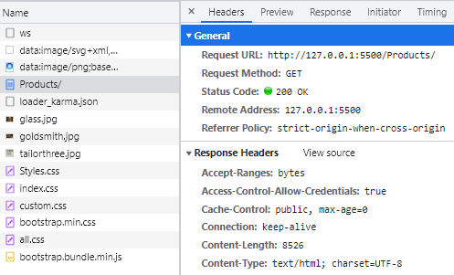
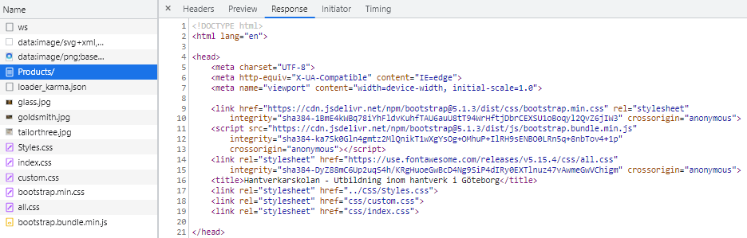
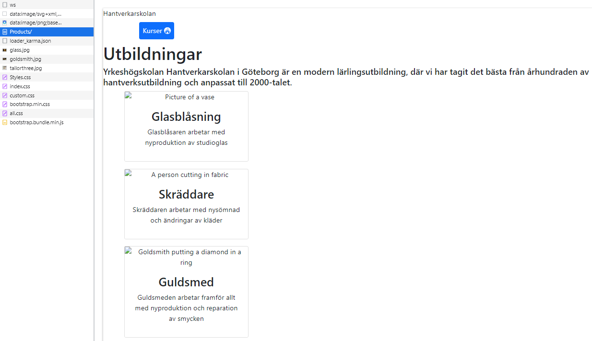
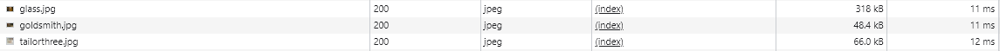
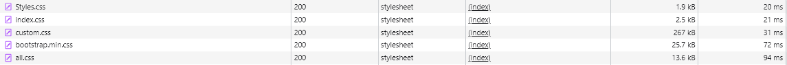
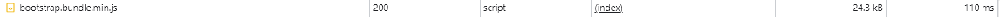
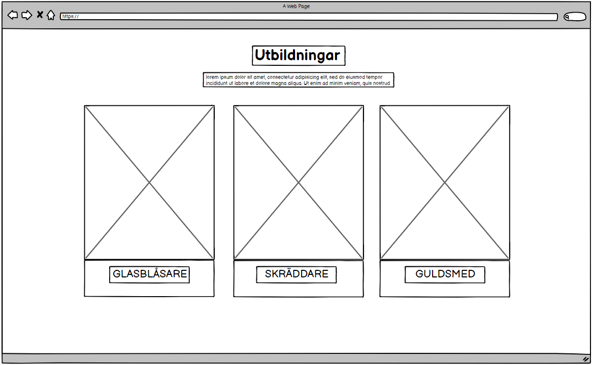
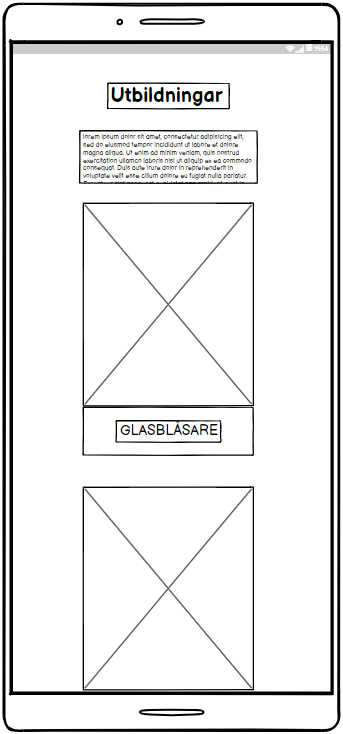
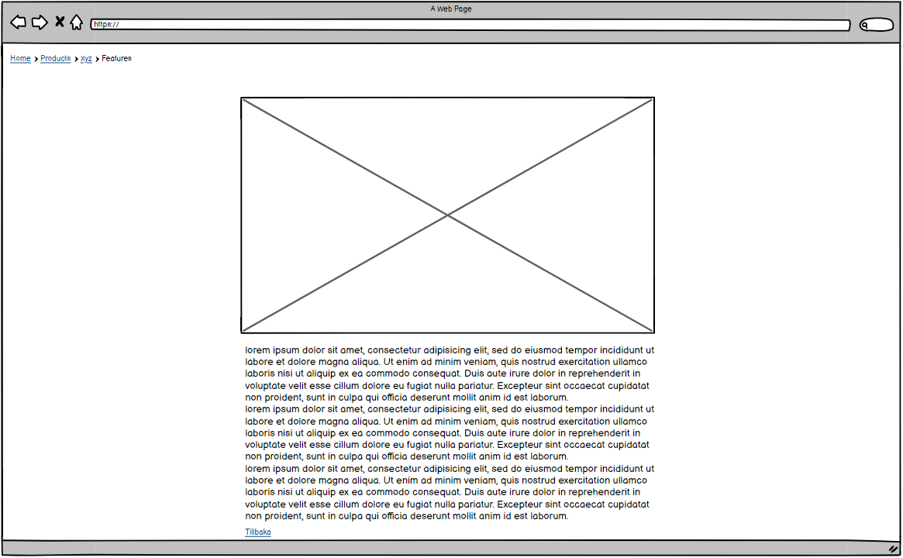

# Projektrapport HTML/CSS

  - [HTTP](#http)
  - [URL](#url)
  - [Wireframes](#wireframes)
  - [SEO](#seo)
  - [Reflektion över lösningar](#reflektion-över-lösningar)

 

## HTTP

Tidslinje på hela konversationen mellan webläsaren och servern för URL http://127.0.0.1:5500/Products/

Här kan man se vilken ordning imformationen hämtas, vad för slags fil den hämtat, hur lång tid det tog och vilket svar requestern fick från servern. Statuskoden 200 OK betyder att webläsaren fick det den frågade om. Hade den inte hittat den fil som efterfrågas hade man fått statuskod 404 som svar.
 
 

 
 
Webläsaren skickar en GET request metod om att hämta data från servern.

 
 
Servern skickar tillbaka en response och börjar med att skicka HTML filen. 
 
 
Det är först när webläsaren har fått HTML filen och läst av den som den sedan kan skicka en ny request om att få resten av datan den behöver för att bygga webbsidan.
 
 

 
 
Först frågar den efter bilderna som finns på sidan.

 
 
Sedan de olika css filerna. Både dom man själv har skrivit och bootstrapen som är länkad från bootstraps egna server.

 
 
Och slutligen så frågar den efter javascript filen.

 
 
Webläsaren fortsätter att skicka requests fram tills dess att den har fått all information den behöver för att bygga hemsidan.

## URL

http://127.0.0.1:5500/Products/  

Schema/protokoll: **http://**

Står för **hypertext transfer protocol** och är det kommunikationsprotokoll som webläsaren använder för att göra en request till servers. Finns även andra protokoll som kan användas.

Ipadress/Domän/Port: **127.0.0.1:5500**

Ipadressen/domän/port är den web servern/datorn som man vill besöka. I detta fallet är det en ipadress som webläsaren vill komma åt.

Path: **/Products**

Path är den sökväg som används för att komma åt en specifik sida eller fil som finns på den domän man försöker besöka. I mitt fall är det /Products som besöks för att komma åt våra utbildningar som finns på vår hantverkarskola.

## SEO

Våran grupp valde att använda oss av sökorden **Utbildning, Hantverk och Göteborg**. Det kändes som an dessa orden va dom mest logiska orden man skulle använda om man ville hitta till våran skola. Jag har testat att googla på just dessa orden och stadsnamn och då hittat olika olika skolor som t.ex. yrkeshögskolor. 

På mina fyra sidor så har jag istället för att använda mig av lorem så kopierade jag utbildningsbeskrivningar m.m. från andra skolsidor och sedan anpassat dom utefter våran information. Det är dock väldigt svårt att få in vissa ord i texten utan att det blir repeterande så har då sett till att det finns andra ord där ordet ingår t.ex **hantverk**et, glas**hantverk** och **hantverk**stekniker. Har haft lite svårt för att hitta om detta är ett korrekt sätt att använda SEO då det står olika på alla sidor man kollar upp.

## Wireframes

**Huvudutbildningssidan Desktopversion**
 
 

 
 

**Huvudutbildningssidan Mobilversion**

Innehållet lägger sig under vartannat när man går över till mobilvyn.
 
 

 
 
**Utbildningsbeskrivningssida Desktop/Mobil**

Tanken med denna layouten va att när man går över i mobilvy så skalas bara bild och text ner för att passa en mindre skärm.
 
 

## Reflektion över lösningar 

Jag hade ansvaret för produktsidorna, eller i vårt fall utbildningssidorna då vi valde att göra en hemsida för en yrkeshögskola.

Jag använde överlagt en enkel design på mina sidor för att det inte skulle bli för svårt att göra sidorna responsiva. Jag blev dock tvungen att skriva om mina media queries då navbaren inte riktigt hängde med. Så jag skrev om dom och använde mig av samma mått som dom andra används sig av.

Det jag tyckte var svårast med att skriva HTML-filen var att komma ihåg att använda sig av semantiska html element och veta när man ska använda `
`. Något jag hade svårt att komma på var hur man använder bilder i html med semantiska element. Jag valde att lägga dom i `<figure>` men vet inte om det är rätt att göra så.

Jag gjorde om mina css-filer till scss. Mest för att jag ville kunna organisera mina klasser och även kunna använda mig av sassvariabler för bootstrapen. Något som jag tycker är lite svårt är att komma på bra klassnamn att använda sig av och att inte skriva mer klasser än vad man behöver. T.ex. så hade jag först användt mig av tre olika `.img` klasser som jag sedan ersatte med en `.img-wrapper` som kunde göra samma sak.

Jag har använt mig av tre olika bootstraps på mina sidor. Cards, accordion och breadcrumb. Innan vi gick igenom bootstraps så hade jag skapat min förstasida genom att länka bilder till sina respektive utbildningssidor och även lägga en länk under. Jag gjorde sedan om dom och använde mig av cardsbootstrap för att få samma utseende. 

Ibland hade jag lite problem med markera rätt del av bootstrapen när jag debuggade därför valde jag att lägga in bootstrap lokalt i mina sidor så att jag kunde använda mig av sassvariablerna och även gå in i scss filen för att leta upp rätt klass för att ändra på en del av bootstrapen t.ex borderna runt knapparna i accordion.

Detta skapade dock lite konflikter i projektet när vi skulle få in navbaren och footern då bootstrapen i mina mappar skrev över den koden. Dom fick då skriva lite ny kod för att överskriva dom bootstrapsen.

