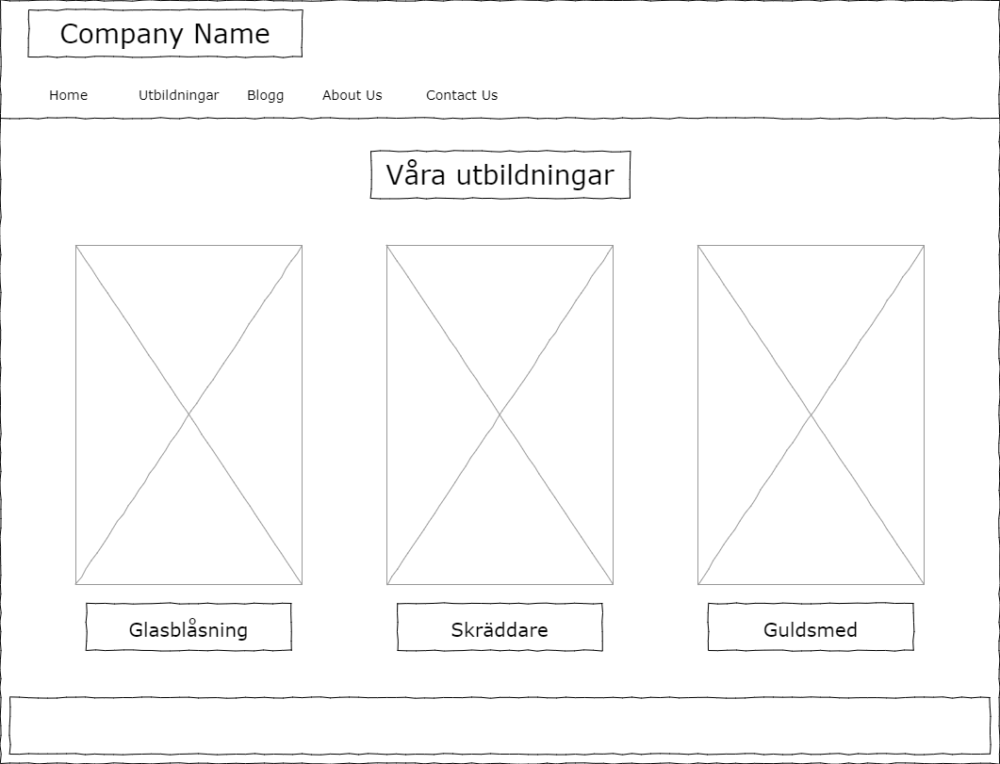
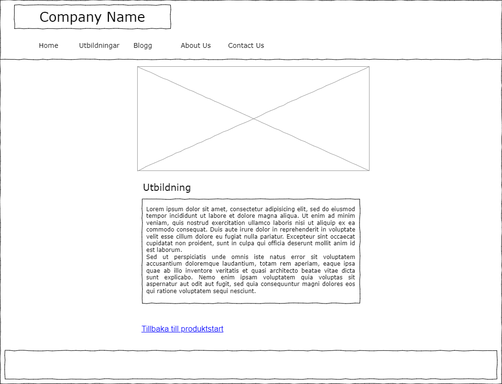

# Projektrapport HTML/CSS

  - [HTTP](#http)
  - [URL](#url)
  - [Wireframes](#wireframes)
  - [SEO](#seo)
  - [Reflektion över lösningar](#reflektion-över-lösningar)
## HTTP

## URL

## Wireframes

Huvudutbildningssidan Desktopversion

Huvudutbildningssidan Mobilversion  
Innehållet lägger sig under vartannat när man går över till mobilvyn.

Utbildningsbeskrivningssida Desktop/Mobil  
Tanken med denna layouten va att när man går över i mobilvy så skalas bara innehållet ner för att passa en mindre skärm.

## SEO

Våran grupp valde att använda oss av sökorden **Utbildning, Hantverk och Göteborg**. Det kändes som an dessa orden va dom mest logiska orden man skulle använda om man ville hitta till våran skola. Jag har testat att googla på just dessa orden och få hitat liknande sidor som våran hemsida ska vara.

På mina fyra sidor så har jag istället för att använda mig av lorem så kopierade jag utbildningsbeskrivningar m.m. från andra skolsidor och sedan anpassat dom utefter våran information. Det är dock väldigt svårt att få in vissa ord i texten utan att det blir repeterande så har då användt mig av andra ord där ordet ingår t.ex <strong>hantverk</strong>et, glas<strong>hantverk</strong> och <strong>hantverk</strong>stekniker. Har haft lite svårt för att hitta om detta är ett korrekt sätt att använda SEO då det står olika på alla sidor man kollar upp.

## Reflektion över lösningar 

 